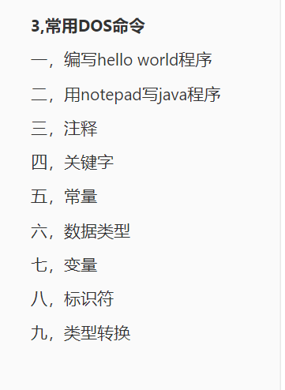

# javax学习记录
## javase学习
Java SE 是 Java 的基础版本，包含了 Java 语言的核心语法、面向对象编程的基本概念、基本数据类型、控制结构、类和对象、方法、异常处理等基础知识。通过学习 Java SE，你可以掌握 Java 编程的基础技能，为后续学习更高级的 Java EE（Enterprise Edition）或其他 Java 相关技术打下坚实的基础。

基础内容：

推荐工具：idea

